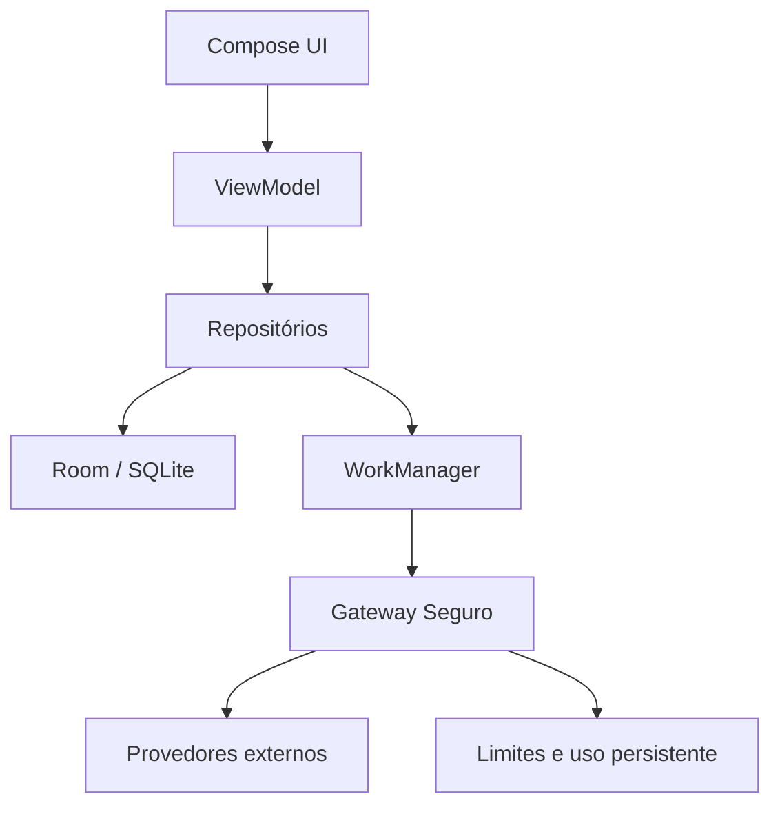

# Arquitetura executável

## Visão geral

O ProspectAI adota arquitetura modular local-first. Room é a fonte de verdade do Android; a UI observa `Flow`s de repositórios e nunca renderiza diretamente uma resposta externa. Toda integração sensível passa pelo Gateway.

## Módulos

| Módulo | Responsabilidade | Dependências permitidas |
|---|---|---|
| `app` | Composition root, Compose, navegação, ViewModel, Workers, notificações | todos os módulos `core` |
| `core:model` | contratos serializáveis e modelos compartilhados | Kotlin Serialization |
| `core:domain` | scoring, deduplicação e políticas puras | `core:model` |
| `core:data` | Room, DataStore, Keystore, Gateway client, repositórios, retenção e backup | `core:model`, `core:domain` |
| `core:designsystem` | tema e componentes visuais | Compose Material 3 |
| `gateway` | autenticação, chaves reais, limites, logs, Places, geocodificação, auditoria e IA | `core:model`, Ktor, OkHttp |

## Fluxo de pesquisa

1. A UI cria um `SearchRun` local em estado `QUEUED`.
2. WorkManager executa o run com requisito de conectividade.
3. O Gateway autentica o token; o Integration Manager aplica cache, limite, retry e seleção de adaptador.
4. Cada empresa recebida é normalizada e comparada a candidatas locais.
5. Somente critério forte permite consolidação automática. Todas as avaliações relevantes são registradas.
6. O snapshot externo e seus metadados são persistidos antes da exposição à UI.
7. A auditoria de website passa por bloqueio SSRF e limite de corpo.
8. O motor determinístico calcula e persiste a nota e os fatores.
9. A IA recebe fatos, serviços ativos e o resultado pronto para gerar explicações.
10. Contadores são atualizados incrementalmente; cancelamento e retomada usam o run persistido.

## Injeção e escopos

`AppContainer` é a única composition root. Dependências usam construtores e interfaces, sem acesso global no domínio. ViewModel e Workers recebem instâncias de escopo da aplicação. A decisão e a compatibilidade de toolchain estão em ADR-0009.

## Concorrência e consistência

- transações Room agrupam mutações de CRM, auditoria e fusão;
- WorkManager garante execução persistente e nomes únicos por pesquisa;
- pesquisas longas usam foreground de tipo `dataSync`, com notificação contínua;
- o estado de cancelamento é verificado entre páginas e empresas;
- retomadas são idempotentes pelo par `searchRunId/companyId`, evitando recontagem de páginas parcialmente processadas;
- o Gateway usa contadores diários/mensais atômicos, métricas de resultado/latência e arquivo de uso em instância única.

## Leitura em escala

O catálogo principal usa Paging 3 diretamente sobre Room. Busca, faixa de pontuação e ordenação permanecem na consulta SQL para evitar materialização da base na interface. Favoritos e a fila operacional são fluxos separados e reativos porque representam conjuntos de trabalho menores e regras próprias de prioridade.

## Política de provedores

Adaptadores podem exigir autorização operacional além da credencial técnica. O Google Places só é considerado configurado quando a chave e `PLACES_DATA_STORAGE_ALLOWED=true` estão presentes. TTL, atribuição e exceções de retenção são documentados por adaptador e revalidados a cada release.
